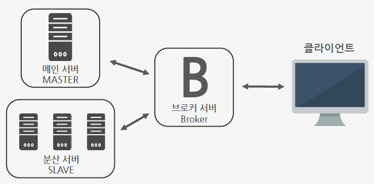

# strawstreaming
클라이언트의 Bandwidth에 따라 적절한 음질로 인코딩하여 분산시스템 방식으로 음원을 스트리밍 해주는 서비스

## 1. Project Overview 
+ ### Project Purpose
  * 서버는 클라이언트(사용자)에게 끊김 없는 음악 스트리밍 서비스를 제공
  * 실시간으로 클라이언트의 밴드위쓰를 검사하여 음악이 끊기지 않는 선에서 최적의 음질을 제공
  * 서버를 마스터와 슬레이브로 나누어 여러 음질로 인코딩 하는 일을 슬레이브들에게 맡김
  * 클라이언트는 모든 슬레이브과 연결할 필요없이 슬레이브들과 클라이언트 사이에 브로커 서버와 연결 
  
+ ### Project Goal
  * 클라이언트(사용자)는 GUI에 재생버튼 클릭을 통해 손 쉽게 음악을 재생
  * 서버(마스터)는 서버(슬레이브)들에게 원본 음원을 전송
  * 각 서버(슬레이브)들은 각자 다른 음질로 받은 음원을 인코딩
  * 라이언트는 자신이 필요한 음원의 이름, 음원의 시퀀스 넘버, 음질 정보를 브로커에게 전송하고 대기
  * 서버(슬레이브)들은 인코딩한 음원을 작은 데이터 그램으로 쪼개어 저장
  * 브로커에게 요청이 오면 필요한 음원의 음질과 시퀀스넘버를 확인하여 전송
  * 브로커는 클라이언트에게 요청받은 해당 음원 파일을 서버(슬레이브)에게 받아서 클라이언트에게 전송
  
## 2. Development environment
+ ### Server - Master
  * Mac OSX
  * IntelliJ
  * Java
+ ### Server - Slave
  * Debian 9
  * 메모장
  * Java
+ ### Server - Broker
  * Mac OSX
  * IntelliJ
  * Java
+ ### Client
  * Mac OSX
  * IntelliJ
  * Java
  
## 3. Project Process & Design
+ ### Process
  * 인코딩 단계
    
   
   * 저장 단계
   
   
   * 요청 단계
   
   
+ ### Design
   
   
## 4. Implement Method
+ ### Server - Master
  * 처음 구현 당시 서버와 클라이언트가 단순히 음원 파일을 세그먼트화하여 전송하고 클라이언트가 재생하는 형식으로 구현
  * 서버 DB의 경우 DB서버를 따로 두려고 했으나, 프로젝트의 DB규모가 크지 않아 서버의 로컬에서 관리
  * 서버를 마스터와 슬레이브 구조로 나누어 서버에서 음질 별로 인코딩하는 부분을 분산시스템화 하여 수행
  * 마스터에서는 클라이언트에게 요청받은 파일을 슬레이브들에게 전송만하면 됨
+ ### Server - Slave
  * 마스터에게 받은 음원을 각자의 슬레이브가 서로 다른 음질로 인코딩
  * 인코딩이 완료 된 후에는 인코딩된 음원을 세그먼트화하여 시퀀스넘버 별로 파일이름을 수정하여 폴더에 저장
  * 브로커에게 요청이 오면 해당 음질의 시퀀스 넘버 음원파일을 브로커에게 전송
+ ### Server - Broker
  * 클라이언트에게 먼저 파일이름을 받아 서버에 현재 파일이 있는지부터 검사하고 있으면 파일 전송
  * 클라이언트에게 받은 음질 정보과 시퀀스번호를 가지고 슬레이브에게 요청하여 해당 파일을 받아오도록 함
  * 슬레이브에게 받아온 파일을 저장하지 않고 그대로 클라이언트(사용자)에게 전송하므로써 브로커의 무게를 줄임
+ ### Client
  * WAV파일과 MP3파일 모두 재생이 가능하나 WAV파일 같은 경우 세그먼트화가 힘들어 MP3파일 용 플레이어를 사용
  * 브로커에게 현재 필요한 음원의 음질과 시퀀스 넘버를 순차적으로 요청
  * 요청한 파일을 순차적으로 받아 재생
  * GUI를 만들고 음원을 요청하는 동시에 재생하는 쓰레드를 GUI에 넣음

## 5. Docs & Video
+ ### Docs
  * [Report](docs/Report.docs)
  * [PPT](docs/PPT.pdf)
+ ### Video
  * [URL](https://www.youtube.com/watch?v=0Xe0_186eok&t=1s)
